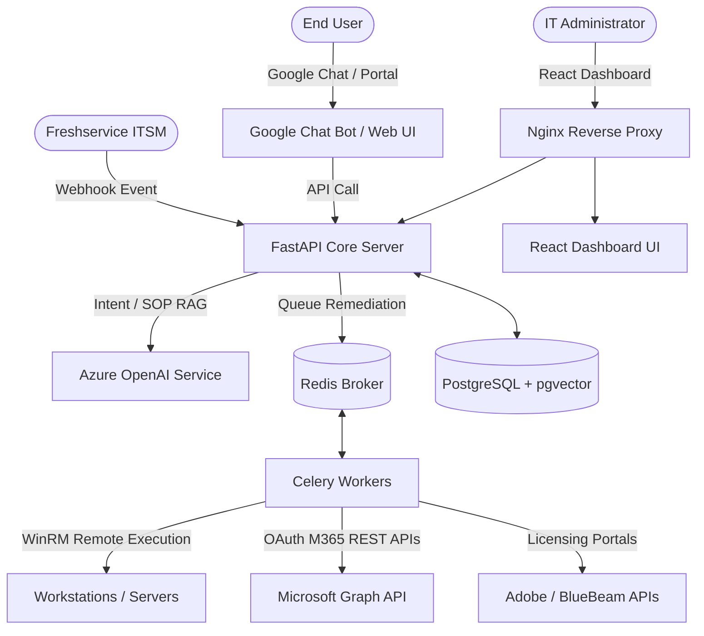

# STACK — Enterprise AI Service Desk

STACK is a high-performance, automated IT service desk dispatcher and auto-remediation platform built for modern enterprise environments. By integrating directly with Freshservice ITSM, Microsoft Entra ID (SharePoint, Active Directory, Office 365), Adobe & Bluebeam licensing systems, and Windows Remote Management (WinRM), STACK handles common IT support workflows with high-accuracy AI and fully automated self-healing scripts.

---

## 🏗️ Architecture Overview



---

## 🔌 Port Mapping & Core Services

When run via Docker Compose, the following services are spun up and mapped to local host ports:

| Service | Port | Description |
| :--- | :--- | :--- |
| **Nginx Web Gateway** | `:80` | Reverse proxy routing dashboard and API endpoints |
| **React Frontend** | `:3000` | Tailwind-optimized IT Operations & Admin Dashboard |
| **FastAPI Core Server** | `:8080` | High-throughput AI router and resolution dispatcher |
| **Google Chatbot** | `:9090` | Google Chat app messaging endpoint for user tickets |
| **PostgreSQL Database** | `:5432` | Standard system data store + `pgvector` for SOP embeddings |
| **Redis Cache** | `:6379` | Celery message broker and real-time state machine cache |

---

## 🛠️ Getting Started & Setup

### Prerequisites
- Docker & Docker Compose
- Python 3.11+
- Node.js 18+ & PNPM

### 1. Environment Variables Configuration
Duplicate the root-level `.env.example` file and configure it:
```bash
cp .env.example .env
```
Ensure you fill in the keys for **Azure OpenAI**, **Freshservice**, **Microsoft Graph**, and **WinRM** (or rely on built-in simulation fallback mode if live services are not available).

### 2. Launching Services via Docker Compose
Build and run the entire ecosystem in detached mode:
```bash
docker compose up --build -d
```

To view live application logs:
```bash
docker compose logs -f api-server
```

---

## 🗄️ Database Seeding

Once the database and services are online, populate the database with groups, agents, SLA settings, SOPs, and mock ticket trends using the python seeding script.

From the project root:
```bash
# Add Python dependencies or run via your virtual environment
python -m scripts.seed_db
```

This populate the following:
- **4 Support Groups**: SharePoint, Licensing, Distribution List, and L2 Windows Support.
- **9 Support Agents**: Bhaskar, Neha, Madhura, Yogesh, Datta Patil, Ajay, Ankit, Hadi, Shameem.
- **Auto-resolution thresholds** & **SLA parameters** mapped per use case.
- **5 pre-analyzed SOPs** with real PowerShell configurations.
- Simulated historical trends, API logs, and ROI indicators for the React dashboard charts.

---

## 🔧 WinRM PowerShell Remediation
Auto-remediation scripts are structured under `scripts/powershell/`:
1. `Reset-Password.ps1` — Active Directory account unlocks & temp password generator
2. `Fix-Printer.ps1` — Spooler restarts & queue clearing
3. `Install-Software.ps1` — Winget automated silent package installations
4. `Cleanup-Disk.ps1` — User temp & system log files purger
5. `Fix-Performance.ps1` — Heavy process utilization optimizer & memory standby lists cleaner
6. `Reset-Network.ps1` — TCP/IP catalog rebuilder & DNS resolver cache flusher
